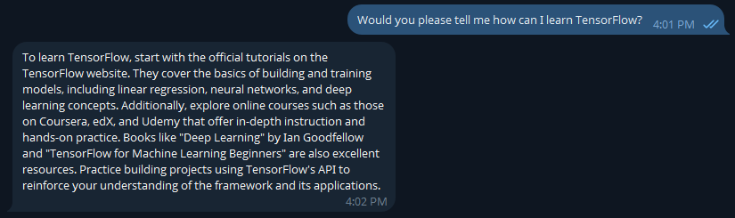

# Telegram RAG assistant
Assume that you are a company or small corporation when you have a product and want to hire an AI to communicate with users through Telegram on behalf of your team as an employee, in which an AI agent responds to users automatically based on the retrieved information or the AI's pre-knowledge itself. Therefore, having an intelligent AI would be the most important thing to provide for your customers. They can communicate with your AI agent to learn more about your company's aim, products, and related information to engage with your team and items. More importantly, this mechanism is available everywhere and at every time of the day.

## Why Telegram?
In this project, I have utilized Telegram for this command because of its capabilities, diversity, and security. You can use an alternative based on what you prefer. However, you need to 

