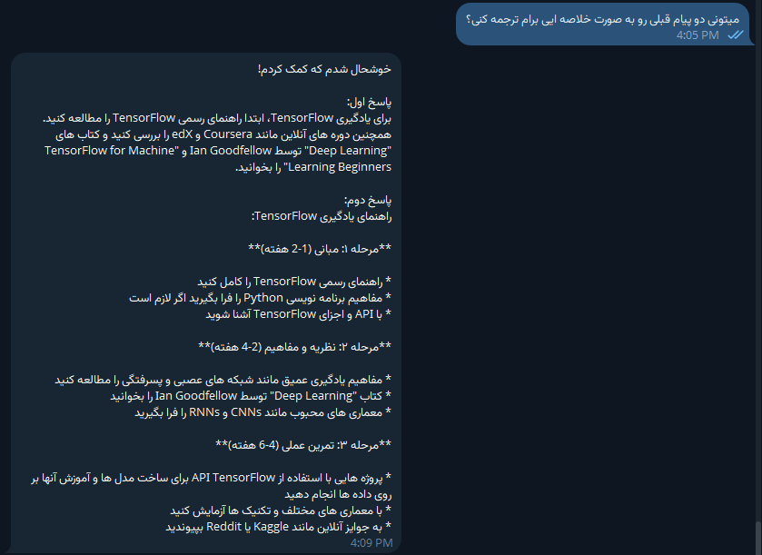

# Telegram RAG assistant
Assume that you have a product and want to hire an AI to communicate with users through Telegram on behalf of your team as an employee at your company, in which an AI agent responds to users automatically based on the retrieved information or by mixing information of both the AI's pre-knowledge itself and your data. Therefore, having an intelligent AI would be the most important thing to provide for your customers. They can communicate with your AI agent to learn more about your company's aim, products, and related information from AI suggestions to let users engage beneficially with your team and items. More importantly, this communication is available everywhere and at any time of the day.

## Why Telegram?
In this project, I have utilized Telegram for this command because of its capabilities, diversity, and security. You can use an alternative based on what you prefer. However, you need a chat environment, which could be designed on your own website.

## Framework setups
To develop this project, we need to handle three main subjects, including ```i)``` Chatting environment (which is Telegram here); ```ii)``` LLM model in the backend (which is local ```llama3.1``` in this project); and ```iii)``` a database to save the logs and chats (which is ```MySQL``` in the current mission).

### i) Creating Telegram chatbot
We need an API to connect our chats with the backend structures. Therefore, we have to address a ```token``` number in Telegram to connect the chats with our backend LLM model through an ```HTTP API```.

Assume that we have a token to access the HTTP API as follows:
```
1023456789:AWFETzeOSSkGyskv1anq5QvTKibQsz-G5xi
```
(Attention: This token is an example and not generated by Telegram)
### ii) Local LLM model
You can select your local LLM model among the many available language models, such as OpenAI's GPT models, HuggingFace models, or Local LLM models. In this project, I have employed ```Ollama (llama3.1)``` model to handle the backend. Even though ```llama3.1``` is built on ```7B``` parameters, it can generate a very accurate response, which I highly recommend for users with limited storage and graphics card. It can also run on a CPU.

### iii) MySQL in practice for database management
In this project, I have utilized MySQL to save the chats. Having this in mind, before any process with the codes, I needed to create a database as follows:
```SQL
My codel;
select dbl;
```





